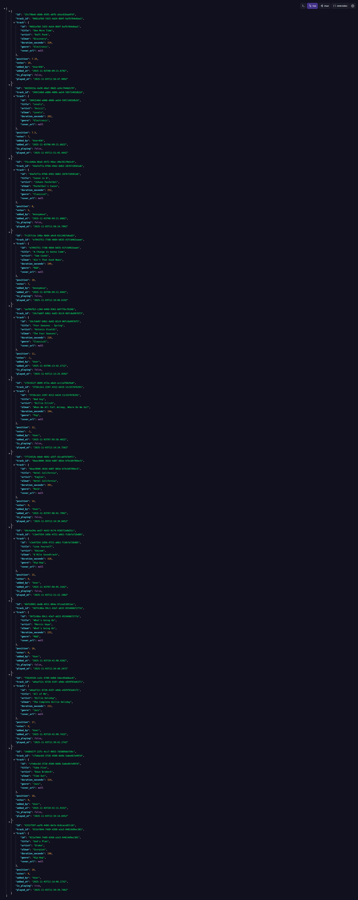
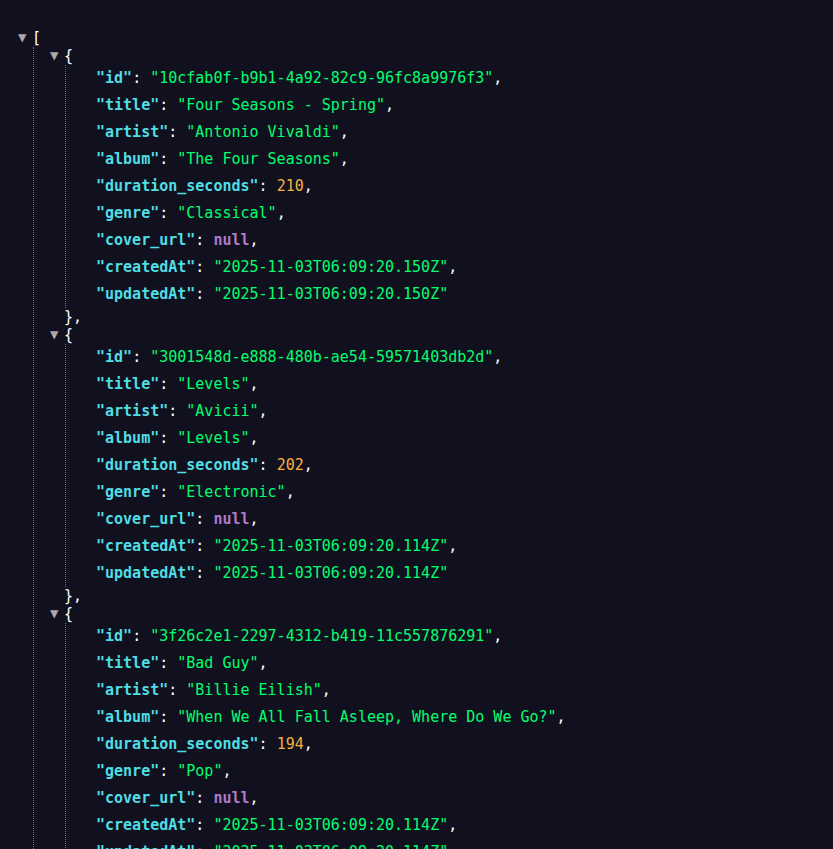

# 🎵 Realtime Collaborative Playlist Manager

A real-time collaborative playlist application where multiple users can add, remove, reorder, and vote on songs in a shared playlist. All changes synchronize in real-time across multiple browser windows.

## Features

- ✅ **Real-time Synchronization**: WebSocket-based updates visible within ~1 second
- ✅ **Drag-and-Drop Reordering**: Smooth reordering with position algorithm
- ✅ **Voting System**: Upvote/downvote tracks with real-time updates
- ✅ **Now Playing**: Simulated playback with progress bar and auto-advance
- ✅ **Track Library**: Searchable library with genre filtering
- ✅ **Connection Status**: Visual indicator for WebSocket connection
- ✅ **Optimistic Updates**: Immediate UI updates with server reconciliation

## Tech Stack

### Backend
- **Node.js** with **Express**
- **Prisma ORM** with **SQLite**
- **WebSocket (ws)** for real-time communication
- **Jest** for testing

### Frontend
- **Next.js 14** with **React**
- **Tailwind CSS** for styling
- **react-beautiful-dnd** for drag-and-drop
- **Axios** for API calls

## Prerequisites

- Node.js 18+ and npm
- Docker and Docker Compose (optional, for containerized setup)

## Quick Start

### Option 1: Docker Compose (Recommended)

**Fully automated setup** - No manual steps required! Database migrations and seeding happen automatically on first startup.

```bash
# Clone the repository
git clone <repository-url>
cd playlist

# Start all services (migrations and seeding run automatically)
docker compose up

# The application will be available at:
# - Frontend: http://localhost:3000
# - Backend API: http://localhost:4000
```

**What happens automatically:**
- ✅ Prisma client generation
- ✅ Database migrations
- ✅ Database seeding (if empty)
- ✅ Backend health check
- ✅ Frontend waits for backend to be ready

**Note:** On subsequent runs, database persists via volume mount, so migrations and seeding are skipped if data already exists.

### Option 2: Manual Setup

#### Backend Setup

```bash
cd backend

# Install dependencies
npm install

# Create .env file (copy from .env.example)
cp .env.example .env

# Generate Prisma client
npm run db:generate

# Run database migrations
npm run db:migrate

# Seed the database
npm run db:seed

# Start the server
npm run dev
```

The backend will run on `http://localhost:4000`

#### Frontend Setup

```bash
cd frontend

# Install dependencies
npm install

# Create .env.local file
echo "NEXT_PUBLIC_API_URL=http://localhost:4000" > .env.local
echo "NEXT_PUBLIC_WS_URL=ws://localhost:4000" >> .env.local

# Start the development server
npm run dev
```

The frontend will run on `http://localhost:3000`

### Default Ports and Endpoints

| Service | URL |
|---|---|
| Web App | http://localhost:3000 |
| API | http://localhost:4000 |
| WebSocket | ws://localhost:4000 |

Heartbeat messages are sent every 25s:

```json
{ "type": "ping", "ts": "<ISO timestamp>" }
```

### Environment Variables

Backend (.env):

```
DATABASE_URL=file:./dev.db
PORT=4000
NODE_ENV=development
```

Frontend (.env.local):

```
NEXT_PUBLIC_API_URL=http://localhost:4000
NEXT_PUBLIC_WS_URL=ws://localhost:4000
```

## Database Seeding

The seed script creates:
- **30-40 tracks** across various genres (Rock, Pop, Electronic, Jazz, Classical, Hip-Hop, R&B)
- **8-10 initial playlist items** with varied vote counts and one track marked as "Now Playing"

To re-seed the database:

```bash
cd backend
npm run db:seed
```

## Running Tests

```bash
cd backend
npm test
```

### API Tests (supertest)

This repo includes API endpoint tests using `supertest` that exercise CRUD and playing/vote flows against an in-memory Express app:

```bash
cd backend
npm test
```

### Manual API Testing

- Postman/Thunder Client collection: `docs/api/postman_collection.json` (targets `http://localhost:4000`).
- Curl smoke script:

```bash
bash docs/api/smoke.sh
```

### Postman/Thunder Client Import

Import the collection at `docs/api/postman_collection.json`:

- Postman: File → Import → Upload File → select `docs/api/postman_collection.json`.
- Thunder Client (VS Code): Collections → Import → select the same file.

Environment: none required; endpoints are hardcoded to `http://localhost:4000`.

### Root Scripts (Convenience)

From the repository root you can run:

```bash
# Run backend tests
npm run test:backend

# Setup database (generate client, migrate, seed)
npm run db:setup

# Seed only / migrate only
npm run db:seed
npm run db:migrate
```

Tests cover:
- Position calculation algorithm
- Database operations
- Vote counting
- Duplicate prevention

## API Endpoints

### Tracks
- `GET /api/tracks` - Get all tracks in library
- `GET /api/tracks/:id` - Get a specific track

### Playlist
- `GET /api/playlist` - Get current playlist (ordered by position)
- `POST /api/playlist` - Add track to playlist
- `PATCH /api/playlist/:id` - Update playlist item (position, is_playing)
- `POST /api/playlist/:id/vote` - Vote on a track (up/down)
- `DELETE /api/playlist/:id` - Remove track from playlist

### WebSocket Events

The WebSocket server broadcasts the following events:

- `track.added` - When a track is added to the playlist
- `track.removed` - When a track is removed
- `track.moved` - When a track is reordered
- `track.voted` - When a track receives a vote
- `track.playing` - When a track is marked as playing
- `ping` - Heartbeat messages every 25 seconds

## Architecture Decisions

### Position Algorithm

The application uses a fractional position system that allows infinite insertions without reindexing:

```javascript
function calculatePosition(prevPosition, nextPosition) {
  if (!prevPosition && !nextPosition) return 1.0;
  if (!prevPosition) return nextPosition - 1;
  if (!nextPosition) return prevPosition + 1;
  return (prevPosition + nextPosition) / 2;
}
```

**Example:**
- Initial: `[1.0, 2.0, 3.0]`
- Insert between 1 and 2: `[1.0, 1.5, 2.0, 3.0]`
- Insert between 1 and 1.5: `[1.0, 1.25, 1.5, 2.0, 3.0]`

### Real-time Sync Strategy

- **Optimistic Updates**: UI updates immediately on user actions
- **Server Reconciliation**: Server responses override local state
- **Event Broadcasting**: WebSocket events keep all clients in sync
- **Reconnection Logic**: Exponential backoff with automatic reconnection
- **Event Deduplication**: Client handles out-of-order messages gracefully

### Database Schema

- **Track**: Library of available tracks (title, artist, album, duration, genre, cover_url)
- **PlaylistTrack**: Playlist entries with position, votes, added_by, is_playing

Unique constraint on `trackId` prevents duplicate tracks in the playlist.

## Environment Variables

### Backend (.env)
```
DATABASE_URL=file:./dev.db
PORT=4000
NODE_ENV=development
```

### Frontend (.env.local)
```
NEXT_PUBLIC_API_URL=http://localhost:4000
NEXT_PUBLIC_WS_URL=ws://localhost:4000
```

## Project Structure

```
playlist/
├── backend/
│   ├── src/
│   │   ├── routes/          # API routes
│   │   ├── websocket/       # WebSocket server
│   │   ├── utils/           # Utility functions
│   │   ├── config/          # Configuration
│   │   └── server.js        # Express server
│   ├── prisma/
│   │   ├── schema.prisma    # Database schema
│   │   └── seed.js          # Seed data
│   └── package.json
├── frontend/
│   ├── app/                 # Next.js app directory
│   ├── components/          # React components
│   ├── lib/                 # Utilities and API clients
│   └── package.json
└── docker-compose.yml
```

## Testing Multiple Windows

To test real-time synchronization:

1. Open the application in multiple browser windows/tabs
2. Perform actions in one window (add, remove, reorder, vote)
3. Observe changes appear in other windows within ~1 second
4. Test connection recovery by temporarily disconnecting the network

## Performance Considerations

- **Large Playlists**: Handles 200+ tracks efficiently
- **Debounced Updates**: Position updates during drag are debounced
- **Efficient Re-renders**: React memoization and selective updates
- **WebSocket Optimization**: Connection pooling and heartbeat management

## Known Limitations

1. **No User Authentication**: All users are anonymous or identified by a simple username
2. **No Audio Playback**: Simulated playback only (progress bars and timers)
3. **No Persistence of Playback State**: Playback state resets on refresh
4. **Single Playlist**: Only one shared playlist (no multiple playlists)

## If I Had 2 More Days...

1. **User Authentication**: JWT-based auth with user profiles and avatars
2. **Multiple Playlists**: Create, share, and manage multiple playlists
3. **Playback History**: Track recently played songs
4. **Keyboard Shortcuts**: Space for play/pause, arrow keys for navigation
5. **Spotify Integration**: Import tracks from Spotify API
6. **Export Playlist**: Export to JSON, CSV, or Spotify playlist
7. **Mobile Responsive**: Full mobile optimization
8. **Undo/Redo**: Action history with undo/redo functionality
9. **Track Preview**: Hover to preview track (if audio files available)

## Demo

### Video Demo

[](https://youtu.be/0euVuo_5s1Y)

The video is also served by the app at `/screenshots/playlist_video.webm` when running locally.

### Screenshots


Place your screenshot file at `frontend/public/screenshots/main-ui.png` so it renders here and is also served by Next.js in the app at `/screenshots/main-ui.png`.

- Main interface with track library and playlist
- Drag-and-drop reordering
- Real-time sync across windows
- Now playing bar with progress

#### Playlist & Track List API JSON Response 







## License

MIT License

## Author

Built as a take-home assignment showcasing full-stack development skills.


```
Alamin Sarker.
Email: alamin.sarker4241@gmail.com
